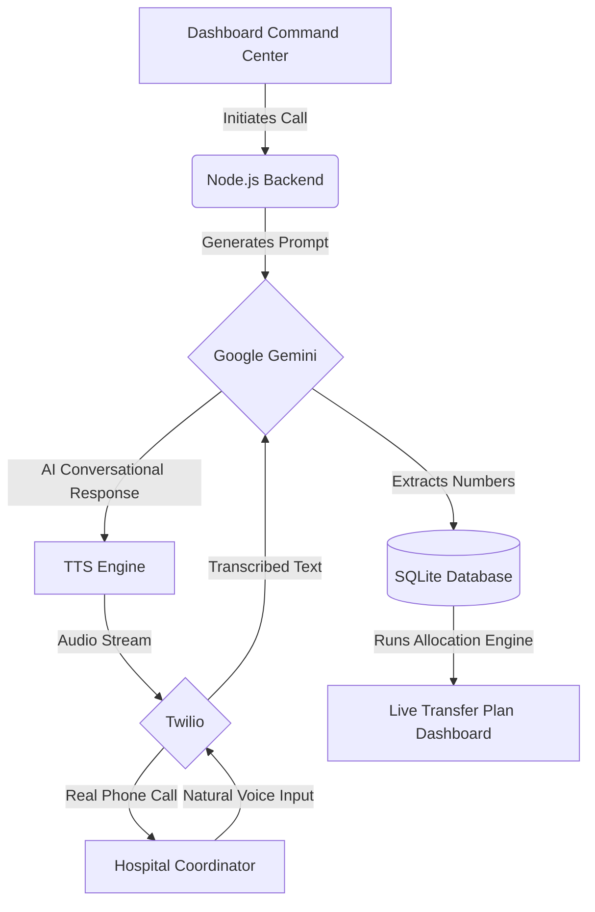

<div align="center">
  <h1>🏥 Aria: Healthcare Resource Allocation AI Voice Agent</h1>
  <p><strong>Winner / Entry for Orion Global Hackathon • Problem Statement #2</strong></p>
  <p>An autonomous AI voice calling system that instantly coordinates hospital beds, ICUs, and ventilators across regional facilities during mass-casualty surges—using real-time phone calls and a greedy optimization engine.</p>
</div>

---

## 📖 Table of Contents
- [🚀 The Problem & Our Solution](#-the-problem--our-solution)
- [🏗️ System Architecture](#-system-architecture)
- [⚙️ How the Optimization Works](#-how-the-optimization-works)
- [🛠️ Tech Stack](#️-tech-stack)
- [✨ Key Features](#-key-features)
- [📋 Prerequisites & Quick Start](#-prerequisites--quick-start)
- [🎯 The Live Demo Flow](#-the-live-demo-flow)
- [🚀 Roadmap](#-roadmap)
- [📝 License](#-license)

## 🚀 The Problem & Our Solution

**The Problem:** During a surge (mass-casualty event, outbreak, or flood), hospitals in the same region often don't know each other's real-time capacity. One facility is overwhelmed and turning patients away, while another 10km down the road has empty beds and idle ventilators. Data collection relies on manual phone calls, spreadsheets, and emails, which breaks down exactly when it matters most.

**Our Approach (Aria):** Aria calls, and the system optimizes.
Aria is an autonomous AI voice agent. She phones each facility coordinator directly. **No app to install, no form, no dashboard login on their end.** She has a natural conversation, asking for their current beds, ICU, ventilator, and staff numbers. 

Once reports are collected, our operations-research allocation engine computes the optimal rebalancing. Command-center staff see the transfer plan on a live web dashboard.

## 🏗️ System Architecture

Our platform is composed of 4 main layers working in real-time:

1. **Call Layer (Twilio):** Handles real outbound phone calls, Twilio's native speech recognition, and Voice (TTS).
2. **Reasoning Layer (Google Gemini):** Maintains natural conversational state and extracts structured numerical data (bed counts, ventilators) from natural speech in real-time.
3. **Data Layer (SQLite):** Automatically saves extracted capacity data as the call progresses.
4. **Optimization Layer (Greedy Heuristic):** A custom algorithm that calculates resource transfers and renders them to the Live Dashboard.



## ⚙️ How the Optimization Works

For each resource type (General Beds, ICUs, Ventilators) independently, we compute every facility's balance (`available` minus `needed`). 
- Facilities split into **Donors** (surplus) and **Receivers** (deficit).
- Both lists are sorted largest-first.
- The algorithm matches Donors to Receivers, transferring the smaller of the two amounts, repeating until every surplus or deficit is resolved.

**Why a Greedy Algorithm?** Speed and Explainability. A command-center operator needs to trust and act on a transfer plan in seconds during a live crisis. A greedy heuristic gives a fast, deterministic, and auditable answer instantly.

## 🛠️ Tech Stack

- **Backend Core**: Node.js, Express.js
- **Real-Time Updates**: WebSockets (`ws`)
- **AI & Reasoning**: Google Gemini API (`@google/generative-ai`)
- **Voice & Telephony**: Twilio Voice, Twilio Media Streams, ElevenLabs
- **Database**: SQLite (`better-sqlite3`)
- **Frontend Dashboard**: Vanilla JavaScript, HTML5, CSS3

## ✨ Key Features

- **Zero Onboarding**: Any facility with a working phone can participate immediately.
- **Speed**: Replaces chaotic email chains and manual spreadsheet reconciliation with a unified API call.
- **Multilingual Foundation**: Built on an engine that supports English, Hindi, and Marathi, making it viable for diverse regional medical staff.
- **Extensible Architecture**: The underlying telephony and reasoning engine is domain-agnostic and can be repurposed for other immediate-response sectors.

## 📋 Prerequisites & Quick Start

### Prerequisites
- Node.js v18+
- Google Gemini API Key
- Twilio / Exotel API credentials (for real calls)
- ElevenLabs API Key (optional, for premium voice)

### Installation
1. Clone the repository and install dependencies:
   ```bash
   git clone <your-repo-url>
   cd AI_Calling_Agent
   npm install
   ```
2. Set up your environment variables:
   ```bash
   cp .env.example .env
   # Edit .env with your Gemini, Twilio, and ElevenLabs API keys
   ```
3. Start the Dashboard Server:
   ```bash
   npm run dashboard
   ```
4. Open your browser to `http://localhost:3001` to view the Live Command Center.

## 🎯 The Live Demo Flow

1. Operator enters a facility name and number, and clicks **Call Facility**.
2. **Aria Dials out**: *"Hello, this is Aria calling from the Regional Hospital Command Center. I need a quick update on your current capacity..."*
3. The coordinator answers naturally.
4. Gemini extracts the numbers mid-conversation and ends the call.
5. The operator clicks **Run Allocation** on the dashboard.
6. The transfer plan is rendered on screen (e.g., "12 beds move from City General to Sunrise").

## 🚀 Roadmap

While the current system is highly functional, our next steps for enterprise-scale deployment include:
- **LP/MIP Optimization**: Evolving from a greedy heuristic to a full linear/mixed-integer program for provably optimal transfers at large scale.
- **Explicit Confirmation**: Asking the caller to verbally confirm extracted numbers ("I heard 5 ICUs, is that correct?") before committing to the database.
- **Joint Optimization**: Factoring in transport distance and travel times, rather than treating resources independently.

## 📝 License
Developed for the Orion Global Hackathon.
