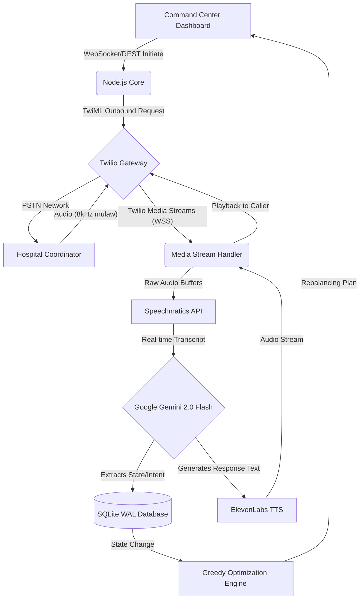

<div align="center">
  <h1>🏥 Aria: Autonomous Healthcare Resource Allocation System</h1>
  <p><strong>Enterprise-grade AI voice agent designed to autonomously balance regional hospital resources (beds, ICUs, ventilators) during mass-casualty events using real-time telephony and deterministic optimization heuristics.</strong></p>
</div>

---

## 📖 Table of Contents
- [Executive Summary](#executive-summary)
- [Real-World Problem & Impact](#real-world-problem--impact)
- [System Architecture & Data Flow](#system-architecture--data-flow)
- [Telephony & Real-Time Audio Pipeline](#telephony--real-time-audio-pipeline)
- [The Resource Rebalancing Algorithm](#the-resource-rebalancing-algorithm)
- [Database & Concurrency](#database--concurrency)
- [Multilingual Capabilities](#multilingual-capabilities)
- [Deployment & Configuration](#deployment--configuration)
- [Future Roadmap](#future-roadmap)

## Executive Summary

Aria is a complete, real-time command center platform that replaces manual capacity data collection with an autonomous conversational AI. Instead of relying on hospital administrators to install apps, fill out web forms, or maintain error-prone spreadsheets during a crisis, the system dials them via standard phone lines. 

Through natural language, Aria converses with coordinators, extracts precise numerical data regarding resource deficits and surpluses, and feeds this into a deterministic Operations Research engine to instantly output an actionable regional transfer plan.

## Real-World Problem & Impact

During regional surges—such as mass-casualty events, localized outbreaks, or natural disasters—the primary bottleneck is **information asymmetry**. 
- **The Breakdown:** Facility A is overwhelmed, while Facility B (10km away) has idle ventilators and empty beds.
- **The Status Quo:** Command centers attempt to reconcile capacity via phone trees and static emails, a process that severely lags behind real-time medical needs.
- **The Aria Solution:** Aria eliminates friction by engaging via standard telephone networks (zero-onboarding for end-users). It scales to hundreds of parallel calls, completing a regional capacity census in minutes rather than hours.

## System Architecture & Data Flow

Aria is built on a highly concurrent, asynchronous event-driven architecture using **Node.js** and **Express.js**.



## Telephony & Real-Time Audio Pipeline

Achieving natural conversation latency requires bypassing standard "Gather and Play" TwiML loops. Aria leverages a true bi-directional streaming pipeline:

1. **Twilio Media Streams**: The system exposes a dedicated WebSocket endpoint (`/twilio/media-stream`) to receive raw `mulaw` audio tracks encoded at 8kHz.
2. **Real-Time Transcription**: Incoming audio chunks are piped instantly to the **Speechmatics Real-Time API**, which provides streaming partial and final utterance transcripts.
3. **Intent & State Reasoning**: Utterances are routed to the `geminiEngine.js` module. Powered by **Google Gemini 2.0 Flash**, this layer manages conversational state, determines if the user is answering a specific resource query (e.g., "We have five beds"), and extracts the numerical values using structured prompt engineering.
4. **Voice Synthesis**: Responses are instantly synthesized using **ElevenLabs TTS**. To minimize Time-To-First-Byte (TTFB), the audio is streamed directly back down the Twilio WebSocket in small buffers, creating sub-second conversational latency.

## The Resource Rebalancing Algorithm

The allocation engine (`resourceAllocator.js`) deliberately utilizes a **Deterministic Greedy Heuristic** rather than a Mixed-Integer Program (MIP). 

**The Mechanics:**
1. **Delta Calculation**: For each discrete resource type (General Beds, ICUs, Ventilators), the system calculates the balance: `Available - Needed`.
2. **Partitioning & Sorting**: Facilities are partitioned into **Donors** (balance > 0) and **Receivers** (balance < 0). Donors are sorted in descending order of surplus; Receivers are sorted in ascending order of deficit.
3. **Greedy Matching**: The algorithm matches the largest donor to the largest receiver, transferring `min(donor_surplus, receiver_deficit)`. This iterates in $O(N \log N)$ time until the market is cleared.

**Architectural Rationale:**
During live crises, command-center operators require *explainability*. A greedy match is fully auditable—an operator can manually trace exactly why Facility A was assigned to Facility B. While a full solver (like Gurobi or CPLEX) might find a mathematically tighter global optimum, it acts as a "black box," which degrades human trust during emergency execution.

## Database & Concurrency

The system utilizes `better-sqlite3` customized for high-concurrency Node.js environments.
- **WAL Mode (`journal_mode = WAL`)**: Write-Ahead Logging is enabled to allow concurrent reads and writes, crucial for the WebSockets continuously polling dashboard state while inbound Twilio streams write extraction results.
- **Schema Design**: Strictly normalized tables for `contacts`, `call_queue`, `call_logs`, and `daily_batches` ensure robust state management and allow for safe retry mechanics if a facility drops a call.

## Multilingual Capabilities

Regional healthcare networks often involve diverse linguistic demographics. Aria natively supports code-mixed multilingual interactions.
- Configurable for **English (`en`)**, **Hindi (`hi`)**, and **Marathi (`mr`)**.
- The `LanguageEngine` parses the contact's preferred language, instructs Gemini to converse in that specific dialect (or code-mixed Hinglish/Marathinglish), and routes the generated text to a specifically tuned ElevenLabs multilingual voice model.

## Deployment & Configuration

### Prerequisites
- Node.js v18+
- API Keys: Google Gemini, ElevenLabs, Speechmatics
- Telephony: Twilio Account SID, Auth Token, and Voice-enabled Phone Number

### Installation
```bash
git clone <repository_url>
cd AI_Calling_Agent
npm install
```

### Environment Setup
Create a `.env` file based on `.env.example`:
```env
PORT=3001
GEMINI_API_KEY=your_gemini_key
ELEVENLABS_API_KEY=your_elevenlabs_key
ELEVENLABS_VOICE_ID=your_voice_id
TWILIO_ACCOUNT_SID=your_sid
TWILIO_AUTH_TOKEN=your_token
TWILIO_PHONE_NUMBER=your_number
```

### Starting the Server
The system relies on an Express server handling both REST routes and WebSockets.
```bash
npm run dashboard
```
For external Twilio Webhooks to reach your local environment during testing, utilize `ngrok`:
```bash
ngrok http 3001
```

## Future Roadmap

- **Geospatial Optimization**: Integrating Google Maps Distance Matrix API to penalize matches between geographically distant facilities.
- **Explicit Checksum Confirmation**: Instructing the AI to read back extracted numbers ("I have recorded 5 ICUs. Is that correct?") to mathematically harden data integrity before database commits.
- **SIP Trunking**: Expanding from Twilio/Exotel to direct SIP trunk integrations for deployment within legacy hospital PBX systems.
