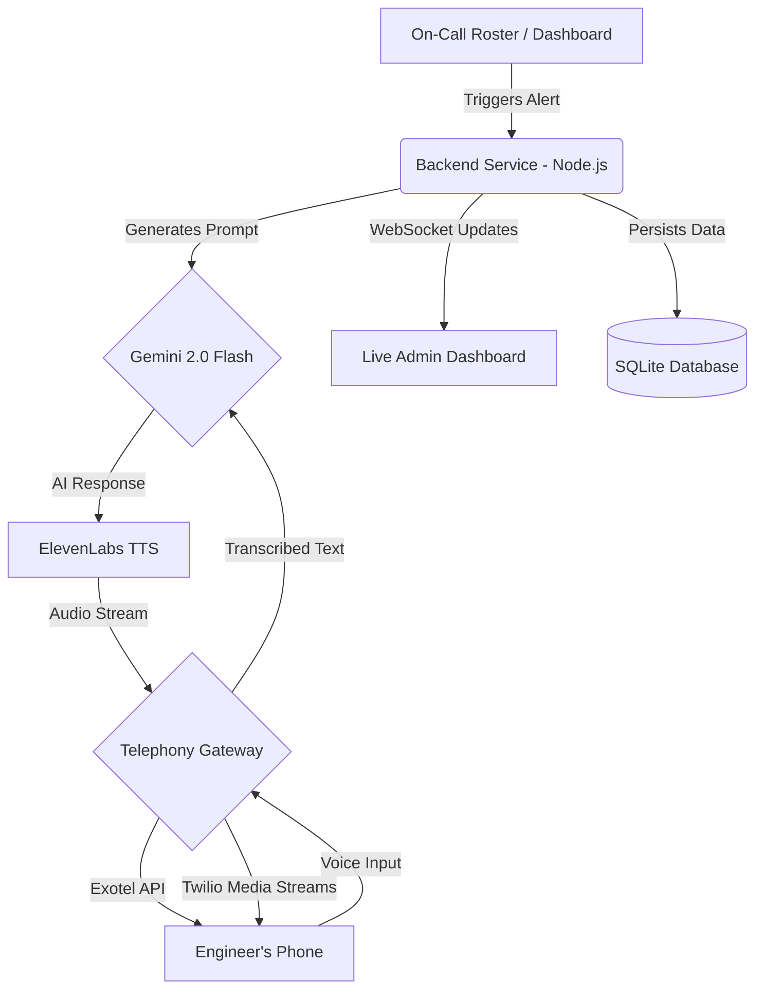

<div align="center">
  <h1>🛡️ Aegis Nexus AI Voice Agent</h1>
  <p><strong>An advanced AI-powered voice calling system for Enterprise Security Incident Response.</strong></p>
  <p>Built to instantly reach on-call engineers with personalized alerts, diagnose server outages, and acquire patch authorizations using real-time conversational AI.</p>
</div>

---

## 📖 Table of Contents
- [🚀 Features](#-features)
- [🏗️ System Architecture](#-system-architecture)
- [🛠️ Tech Stack](#️-tech-stack)
- [📋 Prerequisites](#-prerequisites)
- [⚡ Quick Start](#-quick-start)
- [💻 Available Scripts](#-available-scripts)
- [📞 Telephony Setup (Production)](#-telephony-setup-production)
- [🎯 How It Works](#-how-it-works)
- [📁 Project Structure](#-project-structure)
- [🤝 Contributing](#-contributing)
- [📝 License](#-license)

## 🚀 Features

### 🤖 AI-Powered Conversations
- **Aria** - The autonomous Enterprise Security Copilot.
- **Intelligent Diagnosis**: Powered by **Google Gemini 2.0 Flash** for accurate incident understanding.
- **Multilingual Support**: Natural language processing in English, Hindi, and Marathi to communicate seamlessly with diverse engineering teams (code-mixing with Hinglish/Marathinglish).

### 📍 Incident-Based Alerting
- Connects directly to server health monitoring.
- Diagnoses latency, server outages, or security breaches.
- Provides specific system node details and requests patch authorizations.

### 📞 Real Telephony Integration
- **Cloud Telephony**: Native integrations with **Exotel & Twilio** for actual phone calls.
- **Automated Escalation**: Wakes up on-call engineers and manages escalations (L1/L2/L3) based on responsiveness.
- **Live Monitoring**: Real-time call monitoring and analytics via WebSocket dashboard.

### 🔊 Premium Voice Technology
- **High-Quality TTS**: Integrated with **ElevenLabs TTS** with multilingual voices.
- **Low Latency**: Optimized audio generation for critical, high-stress scenarios.

## 🏗️ System Architecture



## 🛠️ Tech Stack

- **Backend**: Node.js, Express, WebSocket (`ws`)
- **AI Engine**: Google Gemini API (`@google/generative-ai`)
- **Voice / TTS**: ElevenLabs TTS (`elevenlabs`)
- **Telephony**: Exotel Cloud API, Twilio Webhooks & Media Streams (`twilio`)
- **Database**: SQLite with `better-sqlite3`
- **Frontend**: Vanilla JS, HTML5, CSS3 with a modern Dark UI

## 📋 Prerequisites

Before you begin, ensure you have met the following requirements:
- **Node.js** v18+ installed on your machine.
- An active internet connection.
- API keys for the following services:
  - **Google Gemini API**
  - **ElevenLabs API**
  - **Exotel / Twilio** (required only for real, outbound calling)

## ⚡ Quick Start

### 1. Clone & Install
```bash
git clone https://github.com/beutkarshh/CD-Calling-Agents.git
cd CD-Calling-Agents
npm install
```

### 2. Environment Setup
Copy the example environment file and configure your API keys:
```bash
cp .env.exotel.example .env
```
Edit the `.env` file and add your credentials for Gemini, ElevenLabs, and your chosen Telephony provider.

### 3. Start the System
You can start the main dashboard server by running:
```bash
npm run dashboard
```
Then, open your browser and navigate to `http://localhost:3001` to view the live dashboard.

## 💻 Available Scripts

The project includes several built-in scripts for testing and running the application (defined in `package.json`):

- `npm start` - Starts the enhanced system automation.
- `npm run dashboard` - Runs the main Express server and WebSocket for the live dashboard.
- `npm run simulate` - Runs a local simulation of the calling system (useful for testing without real phone calls).
- `npm run test` / `npm run test-batch` - Runs the multilingual automation tests.
- `npm run test-system` - Starts the enhanced system in test mode.

## 📞 Telephony Setup (Production)

### For Local / Browser-Based Testing
The system works out of the box for browser-based testing using text-to-speech simulations without incurring telephony costs.

### For Real Phone Calls
To set up actual outbound incident alerting, you must integrate with a telephony provider.
Follow our detailed **[Calling Setup Guide](CALLING_SETUP_GUIDE.md)** for step-by-step instructions.

**Brief Exotel Setup:**
1. Sign up at [Exotel](https://my.exotel.com).
2. Obtain your **Account SID**, **API Key**, **API Token**, and **Exophone (Phone Number)**.
3. Add these credentials to your `.env` file.
4. Expose your local server to the public internet using [ngrok](https://ngrok.com/) (e.g., `ngrok http 3001`) and configure your webhooks.

## 🎯 How It Works

### The On-Call Engineer Experience
1. **📞 Incident Trigger**: An automated call is initiated from Aegis Nexus AI (Aria) regarding a critical incident (e.g., database latency).
2. **🗣️ Natural Conversation**: The AI speaks naturally in the engineer's preferred language (English, Hindi, or Marathi).
3. **📍 Diagnosis Delivered**: "The database cluster in us-east-1 is experiencing high latency."
4. **🎯 Patch Authorization requested**: "Do you authorize the automated rollback?"
5. **✅ System Action**: The engineer verbally approves or declines. The system records the authorization and proceeds accordingly.

### The System Flow
1. **Roster Import**: Upload a CSV with on-call engineer contact details.
2. **Automated Alerting**: The system traverses the escalation matrix, dialing engineers sequentially.
3. **AI Orchestration**: Gemini processes the real-time conversation and formulates dynamic responses.
4. **Results Tracking**: Everything is logged in the SQLite database, providing analytics on response times, authorization rates, and call outcomes via the live dashboard.

## 📁 Project Structure

```text
CD-Calling-Agents/
├── dashboard-server.js        # Main Express server and WebSocket implementation
├── geminiEngine.js            # Gemini AI integration and Incident Knowledge base
├── exotelIntegration.js       # Real telephony calling logic via Exotel
├── twilioIntegration.js       # Twilio webhooks and Media Streams setup
├── voiceEngine.js             # ElevenLabs TTS integration
├── database.js                # SQLite database management routines
├── public/
│   └── index.html             # Frontend HTML dashboard
├── CALLING_SETUP_GUIDE.md     # Detailed telephony integration documentation
├── .env.exotel.example        # Environment configuration template
└── package.json               # Dependencies and npm scripts
```

## 🤝 Contributing
This is a private project for Aegis Nexus AI. For questions, support, or internal contributions, please contact the core development team.

## 📝 License
Developed exclusively for **Aegis Nexus AI**'s enterprise security incident response initiatives.

---
<div align="center">
  <b>🛡️ Empowering Enterprise DevOps with AI-driven Incident Response — One call at a time!</b>
</div>
